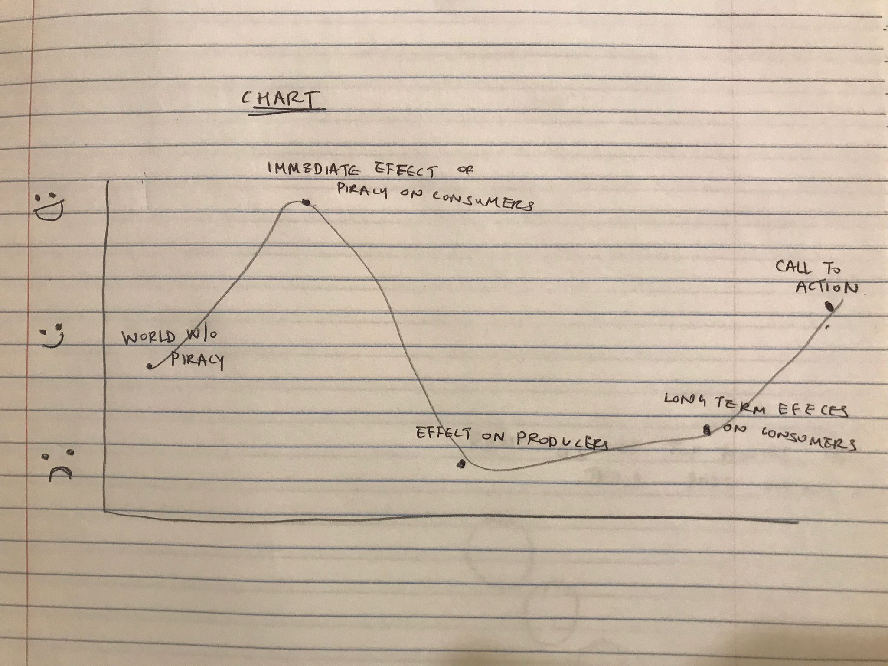
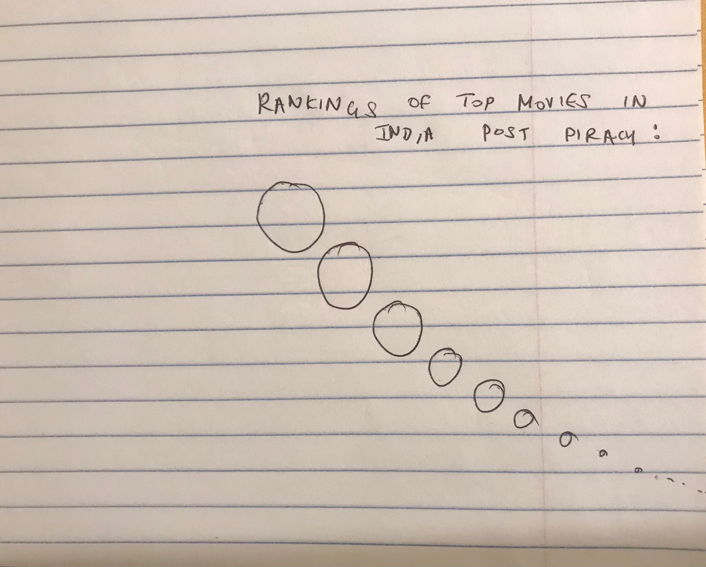
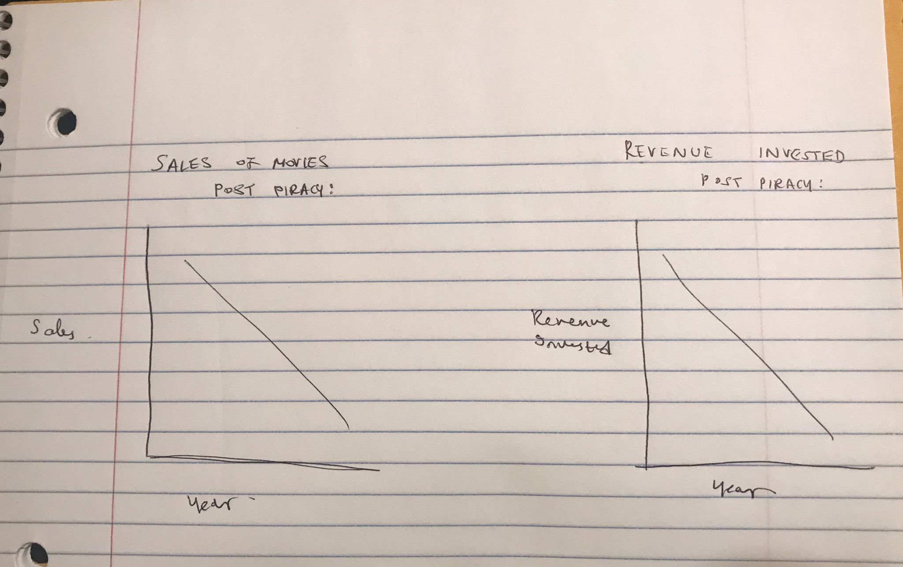

# Final Project - Part 1

## Topic 
#### Summary:
##### As a reader I want to know the effect of piracy in India on the quality of films and film sales so that I can make more informed decisions on how I consume content.

#### Call to action: 
##### I can do this by buying content legally going forward and not streaming on piracy platforms. 

## Preliminary Sketches:  

## Structure of the project: 

##### I will begin by talking about the timeline of the beginning of piracy in india. I will then look at the change in sales of movies, the change in revenue invested by producers into their movies, and the change in the quality of movies, after the onset of piracy in India.

##### I will delineate how piracy discourages filmmakers to invest in their films because of falling legal sales of their movies, which means lower quality of movies made. Thus, while the consumers think they're being smart by illegally streaming content, they are also losing out on quality content being produced in the country. And since it is the film watchers who are the end-user of movies, they lose out significantly. 

##### I will then compare academy Awards by country, pre and post piracy, to show the better quality of movies in countries with lesser piracy practices. I will use data from Germany, UK, France, Mexico, Italy, and Spain. 

## Data and Sources: 
##### My preliminary data will come from the data collected by two professors - Michael Smith and Rahul Telang, from their research papers done on the subject. 

[Academy Awards Data](Academy Awards Data.xlsx)

##### I will be using Shorthand to deliver my final project. 

