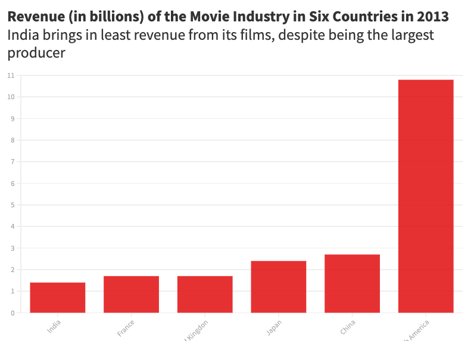

# Final Project - Part II

## Topic 

### The effect of piracy on the quantity of movies supplied and quality of movies in the Bollywood film industry in India. 

#### With the proliferation of Video Cassette Recorders (VCRs) and largely unregulated cable television in the 1980s, India saw an increase in unpaid airing and viewership of films. With little to no laws against piracy, businesses cropped up selling pirated movies in all langauges. For the purpose of this story, we will look at piracy of Hindi films, known as Bollywood, in India. 

#### We will first look at where India stands in producing movies and its revenue. We will then begin our study by looking at the entertainment consumption scene in India before VCRs. Then, we will look at the impact that piracy had on the revenue generated by the film industry in the period when piracy boomed, ie, 1985 - 2000. We will seek to answer the following questions: 
* Did piracy increase or decrease revenue? 
* Did the volume of new movies being made change in response to piracy? 
* Did the quality of movies change in response to piracy? 
* What happened after the 2000?

#### India, is, and has been, the largest producer of movies in the world, thanks to its population of 1.3 billion people who welcome entertainment with open arms. For example, n 2006, US producers made 500 movies, while India made 1000. The investment, however, is much less for Indian producers. In 2010, US filmmakers invested around $9.2 billion on 754 movies, while Indian producers invested $479 million on 1274 movies. This, however, could be due to the differences in currency and their worth, but the difference is significant nonetheless. Despite producing so many movies, the revenue that producers make in India is the lowest, wehen compared to other countries with high volume of movies produced. 

#### Before VCRs and cable television changed how Indians consumed content, movie-buffs would go to theatres to catch their dose of entertainment. Films would be screened at single-movie theatres with a capacity of a 100 to 1000, depending on the size of the theatre. Each theatre would only show 3-4 movies per day because each movie ran for 2.5 to 3 hours. In 1985, there were about 12,500 theatres in India. When the VCR was introduced in the market in India in the early 1980s, video-casette libraries began increasing, reaching 30,000 by the late 1980s (Mittal, 1985). With more disposable income to spend on entertainment, big families would pool in money and invest in a VCR, and then rent out/buy casettes of different movies. One VCR served many viewers, and so even if the overall number of VCRs in the country ware low, the number of people using the instrument was higher, especially since communal gatherings every evening were common in India at the time.  

### The impact of piracy on revenue: 

#### This portion will visualize data that shows how as a result of widespread piracy, revenue dipped during 1985-2000, and then began increasing again. 

### The impact of piracy on supply: 

#### This portion will visualize data that shows how production of new movies reduced as a result of lowered revenues to producers. 

### The impact of piracy on quality of films: 

#### This portion will look at the ratings of 20 famous Bollywood movies in the 1960-2000 period to show the decline in the quality of movies post-piracy as a result of lowered revenue and filmmakers not wanting to invest as much into films when the return-on-investment was low. 

### 2000 onwards: 

#### The end of the 1990s saw more stringent laws governing piracy with the amdneded Copyright Act being implemented in 1995. The number of malls in India also increased in the early 2000s, which meant more theatres got built. The anti-piracy laws and the increase in theatres acted as incentive to producers to invest more in their movies and create better content, which ultimately increased revenue, supply, and quality of movies produced in Bollywood. 

## Feedback: 

### Respondent 1: 

#### Q: Is it clear and understandable? 
#### A: Yes. I found it easy to understand and the story line was clear and smooth. 

#### Q: What can I change about it? 
#### A: The colored computer infographic is mono-chromed, maybe that can change. Also, more variations or unique kinds of charts used may be more interesting to see. 

#### Q: Do you feel engaged? 
#### A: Personally, I don't connect with the topic because I'm not familiar with movies in India. And as a consumer, I think pirating movies is fine, given that people still go to theatres anyway. I am engaged in the sense that I wanted to read anyway, and did feel engaged and wanting to know more. 

#### Q: Do you understand what the call to action is?
#### A: Don't watch pirated movies? 

#### Q: Other comments/thoughts
#### A: I don't know how large the scope of your project can be, but maybe you could have gotten more data and studied how streaming impacted films in India, because that was a huge curveball too. 

### Respondent 2: 

#### Q: Is it clear and understandable? 
#### A: Yes your story has good structure. 

#### Q: What can I change about it? 
#### A: The infographics can have better titles and subheadings to explain what you're trying to convey better. If you put year on the x-axis, try not to change that and put it on the y-axis in the next graphic. 

#### Q: Do you feel engaged? 
#### A: Yes, the topic is interesting and it has a good structure to it. It would be nice to have more data and include other countries, because the data seems rather limited here. 

#### Q: Do you understand what the call to action is?
#### A: Yes, piracy reduces the number of films produced and their quality, so be mindful of the impact of watching pirated movies. 

#### Q: Other comments/thoughts
#### A: What is the color theme you're using? It might be nice to do a black-and-white theme, because it's older movies.  

### Sources: 

###### Mittal, A., 1995. Cinema Industry in India: Pricing and Taxation. Indus Publishing Company, New Delhi.
###### Telang, R., Waldfogel, J., 2018. Piracy and new product creation: A Bollywood story
###### https://www.boxofficemojo.com/year/1980/
###### https://www.boxofficemojo.com/intl/

