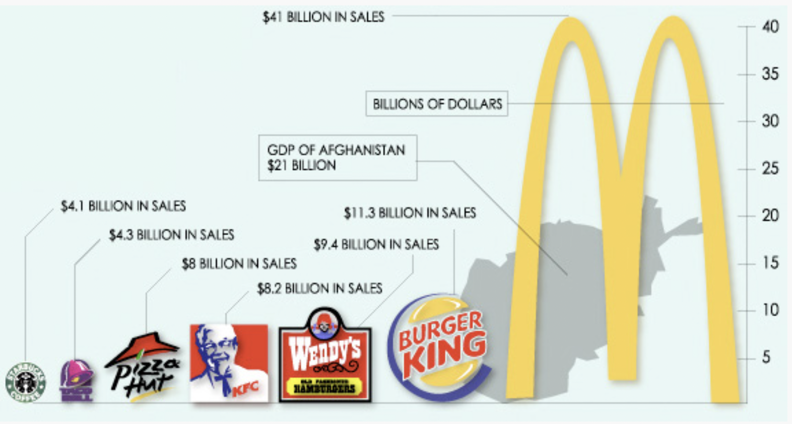

# Project 2: Recreating a Data Visualization

## Original Visualization

#### Source:

### I chose this visualization because it has the scope to be redesigned to convey meaning in a much simpler manner. I think the giant McDonald's sign is unnecessary and conveys the wrong information. It makes it seem like the revenue of McDonald's is about 10 times of that of Starbucks, when really it's only about 4 times greater than Starbucks' revenue. Here, the sizes of the logos in comparision with each other is trying to convey more meaning than the actual numbers. Moreover, randomly putting the GDP of Afghanisthan is unnecessary and confusing. Readers may not know what to take home from the infographic. 

## The Redesigning Process 

### I first decided that I want to change the narrative of the graphic. Since McDonald's has the highest sales revenue of the seven companies, I will highlight it in comparision to the others. For this, I decided that I wanted McDonald's to be in color, and the rest to be grayed out. I also thought that the original infographic had unnecessary repetition of the world "billions" and also had too much going on with the logos. I decided to keep it simple and try to convey the information objectively. Stephen Few's Data Visualization Effectiveness Profile made me ask whether the graphic was useful for the intended audience and if it was understandable. 

