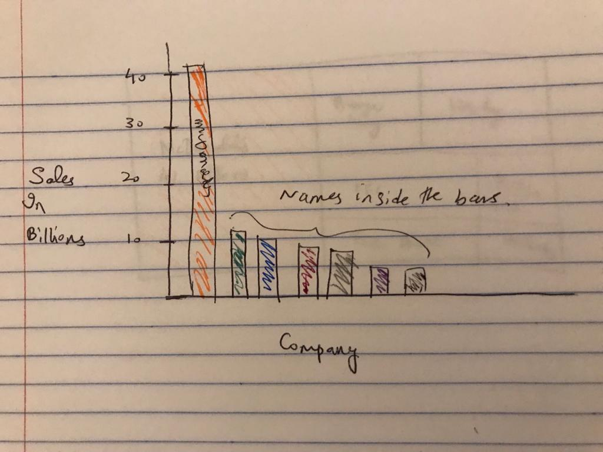
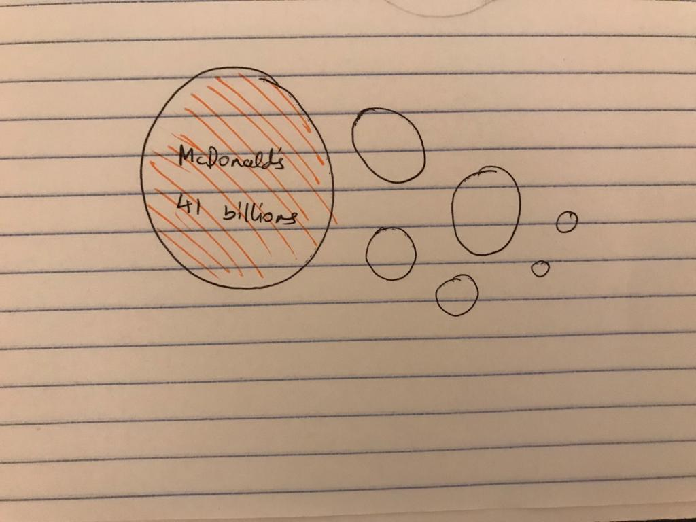
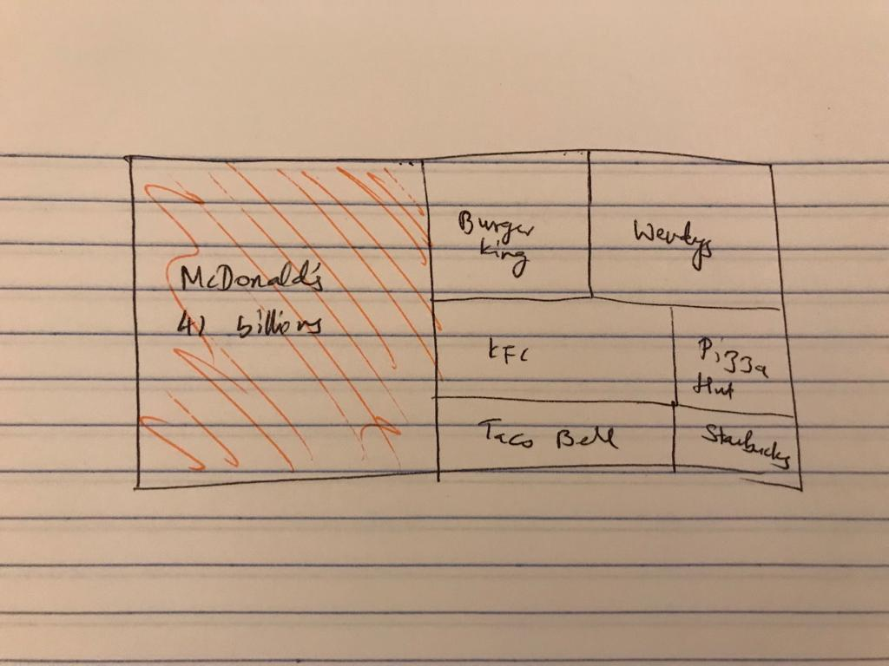

# Project 2: Recreating a Data Visualization

## Original Visualization

#### Source: Business Insider (shorturl.at/juxGQ)

### I chose this visualization because it has the scope to be redesigned to convey meaning in a much simpler manner. I think the giant McDonald's sign is unnecessary and conveys the wrong information. It makes it seem like the revenue of McDonald's is about 10 times of that of Starbucks, when really it's only about 4 times greater than Starbucks' revenue. Here, the sizes of the logos in comparison with each other is trying to convey more meaning than the actual numbers. Moreover, randomly putting the GDP of Afghanistan is unnecessary and confusing. Readers may not know what to take home from the infographic. 

# The Redesigning Process 

### I first decided that I want to change the narrative of the graphic. Since McDonald's has the highest sales revenue of the seven companies, I will highlight it in comparison to the others. For this, I decided that I wanted McDonald's to be in color, and the rest to be grayed out. I also thought that the original infographic had unnecessary repetition of the world "billions" and also had too much going on with the logos. I decided to keep it simple and try to convey the information objectively. Stephen Few's Data Visualization Effectiveness Profile made me ask whether the graphic was useful for the intended audience, and if it was understandable. Though the data is simple and doesn't have too much information, I think the visualization presented isn't understandable and effective. The effectiveness prfile also asks if the graphic is truthful, and I think the way the data is presented paints a skewed picture. 

## Wireframing a Solution 

### At first, I thought a bar chart would be a good idea to represent the data. This was before I decided to only focus on McDonald's' sales. The preliminary sketch I came up with was this: 

## Feedback

### When I showed this to people, these were the comments and suggestions that I received: 

* Narrow the focus to one company/one story 
* Don't color every company, only highlight what is imperative to your story 
* A bar chart is boring, try something else 

### These suggestions were interesting to me because it made me realize how conditioned I am to resorting to bar charts (which are great, but are also boring sometimes). I then tried out a bubble chart: 

### At this point, I decided that I wanted to make McDonald's my main focus, and so I colored only that and figured I would shade the rest in gray. However, the story I wanted to tell with the visualization was about how McDonald's' sales revenue was nearly the same as the other 6 companies combined. For this, I decided a tree map would be the best fit as it gives you the visual understanding that it's almost the same as the other companies combined. I chose to color the McDonald's portion in yellow, because it's the main color in their logo and people can associate the color with the brand. 

## The Final Redesign 

